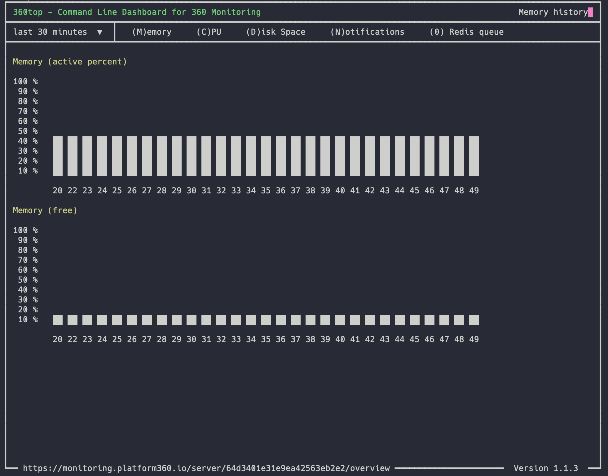

# 360top - Command Line Dashboard for 360 Monitoring

With the 360 Monitoring command line tool `360top` you are able to see all major monitoring information for the current server.

The idea is that you do not have a context switch when you try to fix a problem.

> You will need a 360 Monitoring account to use this command line tool. You can create it under [app.360monitoring.com/signup](https://app.360monitoring.com/signup).




## Installation

Download the latest version of our PHAR archive and give it afterwards rights to be executed. To run 360top you need PHP
installed.

```shell
wget https://github.com/leankoala-gmbh/360top/releases/latest/download/360top.phar
chmod +x 360top.phar
```

Most likely, you want to put the 360top.phar into a directory on your PATH, so you can simply call forrest from any
directory (global install), using for example:

```shell
sudo mv 360top.phar /usr/local/bin/360top
```

## Initialization

After the installation you just have to call the `init` command by running:

```shell
360top init
```

There you have to enter your server ID (if the 360 agent is installed the tool will find the ID automatically) and the API token which you can create in the 360 Monitoring backend.

- [Plesk Platform 360 API key URL](https://monitoring.platform360.io/api-keys/list)
- [360 Monitoring API key URL](https://app.360monitoring.com/api-keys/list)

If you want to automate the initialization you can use [our examples](/docs/install.md).

## Usage

To run the 360top command line tool simply run

```shell
360top
```

## Update

The CLI script can update itself by running the following command. 

> Is this tool is pretty new we recommend to update 

```shell
360top update
```

## Change Log

- **Version 1.2**
  - Auto refresh the graphs after 60 seconds


- **Version 1.1**
  - `init` now works with command line options and can be used in scripts  
  - The interval for the data can be chosen (30min, 1h, 1d and 1m)
  - Added correct label to graph
  - API requests are cached for 60 seconds
  - Accept ESC to exit drop down menu
  - Reduced artifacts on exit
  - Fix: Pagination works with only one page


- **Version 1.0**
  - Show historic data for memory, cpu, disc space and notifications
  - Show custom metrics
  - Initialization script
  - Auto build the phar file
  - Open notifications are marked red
  - Do not show pressed key
  - Added command description
  - Set version number
  - Add `self-update` command
  - Version handling
  - Fix: PHPStan
  - Fix: Open notifications do not have an end date

## Ideas / Todos

- Show current incidents on corresponding metric page
- Live data using 360 agent
- Error handling for API errors
- Modal component
- Auto-refresh after 60 seconds
