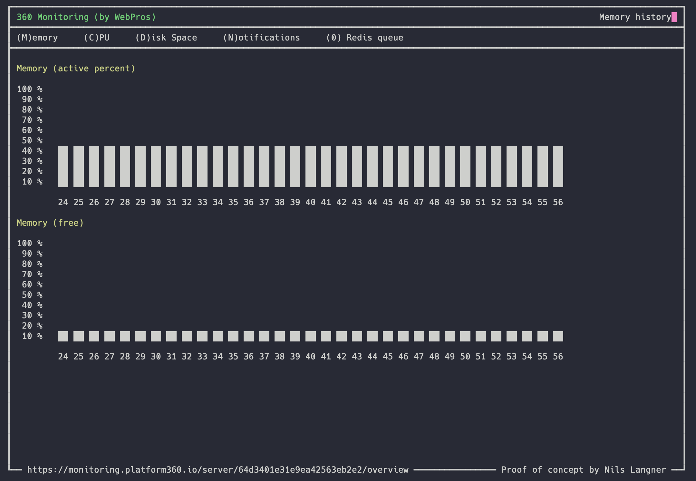

# 360 Advanced TOP

With the 360 Monitoring command line tool `360top` you are able to see all major monitoring information for the current server.

The idea is that you do not have a context switch when you try to fix a problem.

> You will need a 360 Monitoring account to use this command line tool. You can create it under [app.360monitoring.com/signup](https://app.360monitoring.com/signup).




## Installation

Download the latest version of our PHAR archive and give it afterwards rights to be executed. To run 360top you need PHP
installed.

```shell
wget https://github.com/leankoala-gmbh/360top/releases/latest/download/360top.phar
chmod +x 360top.phar
```

Most likely, you want to put the 360top.phar into a directory on your PATH, so you can simply call forrest from any
directory (global install), using for example:

```shell
sudo mv 360top.phar /usr/local/bin/360top
```

## Change Log

- develop
  - Open notifications are marked red
  - Do not show pressed key
  - Fix: Open notifications do not have an end date


- 1.0
  - Show historic data for memory, cpu, disc space and notifications
  - Show custom metrics
  - Initialization script
  - Auto build the phar file
